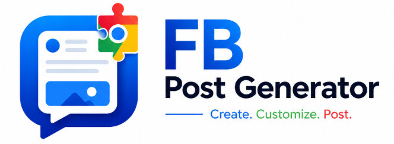

# FB Post Generator — Chrome Extension

<p align="center">
  
</p>

A Chrome extension that generates high-impact, news-style Facebook image posts using ChatGPT or Google Gemini. It opens as a side panel on either chat site and injects fully crafted prompts into the chat input.

## Features

- **Image Ratio** — Choose 1:1 (Square), 3:4 (Portrait), or 9:16 (Story). Default is 3:4. Selection is saved and restored on next browser session.
- **Language** — English, German, Italian, French, Spanish, Swedish, Danish, Dutch, Portuguese, Norwegian, Finnish. Default is English. Saved across sessions.
- **Country / Context** — Auto-populated based on language (e.g. English → UK, USA, Australia, New Zealand). Used for localised news tone.
- **Source: URL** — Paste an article URL. The prompt instructs ChatGPT to extract information from the article and create a tabloid-style news image.
- **Source: Text** — Type up to 1000 characters describing the news topic. The prompt builds a headline-driven image from scratch.
- **Image Upload** — Optionally attach an image via click, drag & drop, or Ctrl+V paste. The image is uploaded into ChatGPT alongside the prompt.
- **Generate** — Builds the full prompt, injects it into ChatGPT's input, and clears the form for the next post.
- **Copy Fallback** — If prompt injection fails, a "Copy Prompt to Clipboard" button appears so you can paste manually.

## Supported Countries

English (UK, USA, Australia, New Zealand, Canada), German (Germany, Austria, Switzerland), Italian (Italy), French (France, Belgium, Switzerland), Spanish (Spain), Swedish (Sweden), Danish (Denmark), Dutch (Netherlands, Belgium), Portuguese (Portugal, Brazil), Norwegian (Norway), Finnish (Finland)

## Installation

1. Clone or download this repository.
2. Open Chrome and navigate to `chrome://extensions/`.
3. Enable **Developer mode** using the toggle in the top-right corner.
4. Click **Load unpacked** and select the `facebook-post-create-extension` folder.
5. The extension icon will appear in your Chrome toolbar.

## Usage

1. Open [chatgpt.com](https://chatgpt.com) or [gemini.google.com](https://gemini.google.com) in Chrome.
2. Click the **FB Post Generator** extension icon in the toolbar to open the side panel.
3. Configure your settings:
   - Select **Image Ratio**, **Language**, and **Country**.
   - Choose **URL** or **Text** as your content source.
   - Optionally upload a reference image.
4. Click **Generate**.
5. The prompt appears in the chat input (ChatGPT or Gemini, whichever is the active tab). Review it and press Send.

## Project Structure

```
facebook-post-create-extension/
├── manifest.json            # Chrome Manifest V3 configuration
├── background.js            # Service worker — enables side panel on ChatGPT and Gemini tabs
├── content.js               # Content script — injects prompts and images into ChatGPT or Gemini
├── sidepanel/
│   ├── index.html           # Side panel UI
│   ├── styles.css           # Dark theme styling
│   ├── app.js               # Form logic, settings persistence, prompt construction
│   └── logo.png             # Branding logo shown in the side panel header
├── icons/
│   ├── icon16.png           # Toolbar icon
│   ├── icon48.png           # Extensions page icon
│   └── icon128.png          # Chrome Web Store icon
└── README.md
```

## How It Works

1. **background.js** enables the side panel only when the active tab is ChatGPT or Gemini.
2. **sidepanel/app.js** manages the form, persists user preferences to `chrome.storage.local`, and builds the full prompt string based on the selected source type (URL or Text).
3. When the user clicks Generate, the side panel sends the prompt (and optional image) to **content.js** via `chrome.tabs.sendMessage`.
4. **content.js** detects which platform it is running on (ChatGPT's ProseMirror editor vs. Gemini's Quill `rich-textarea`), locates the chat input field, injects the prompt text, and attaches any uploaded image using the file input or paste/drop simulation.
5. The user reviews the prompt in the chat and presses Send.

## Prompt Templates

### URL Source

Creates a tabloid/news-style image from an article link. Includes guidelines for:
- Visual style (dramatic, cinematic lighting, bold typography)
- Headline rules (short, emotionally charged, curiosity-triggering)
- Text layout (highlighted keywords, clean hierarchy)
- Image composition (public figures, official backgrounds)
- Restrictions (no hashtags, URLs, logos, or watermarks)
- Viral Facebook caption suggestion

### Text Source

Creates a headline-driven news image from a text description. Includes:
- Category tag (ECONOMY, POLITICS, BREAKING, WORLD)
- Realistic photojournalism background
- Uppercase attention-grabbing headline
- Country context for localisation
- Language-specific output
- Viral Facebook caption suggestion

## Customisation

- **Icons** — Replace the PNGs in `icons/` with your own 16x16, 48x48, and 128x128 images.
- **Languages/Countries** — Edit the `LANG_COUNTRY_MAP` object in `sidepanel/app.js` to add or remove options.
- **Prompts** — Modify `buildUrlPrompt()` and `buildTextPrompt()` in `sidepanel/app.js` to adjust the generated prompts.

## Requirements

- Google Chrome (version 114 or later for Side Panel API support)
- A ChatGPT account at [chatgpt.com](https://chatgpt.com) and/or a Google account for [gemini.google.com](https://gemini.google.com)

## License

MIT
